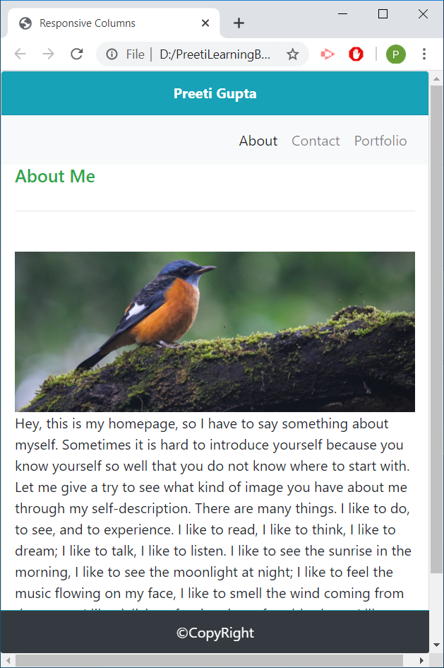
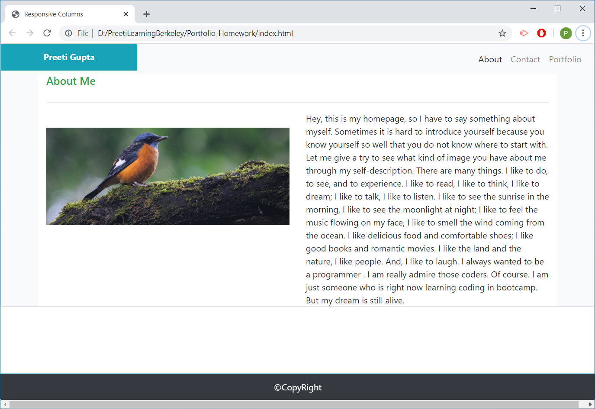
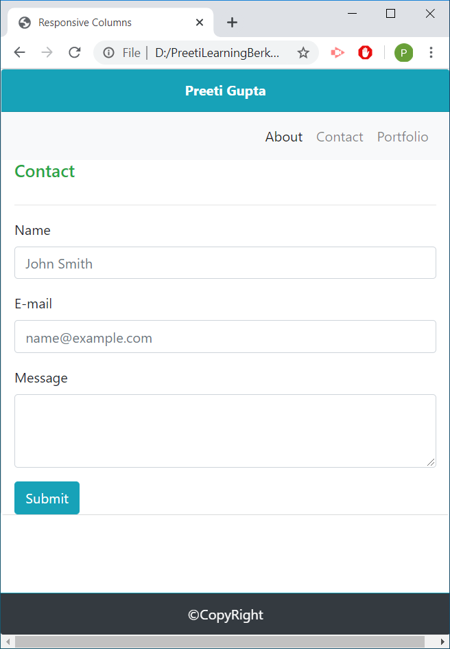
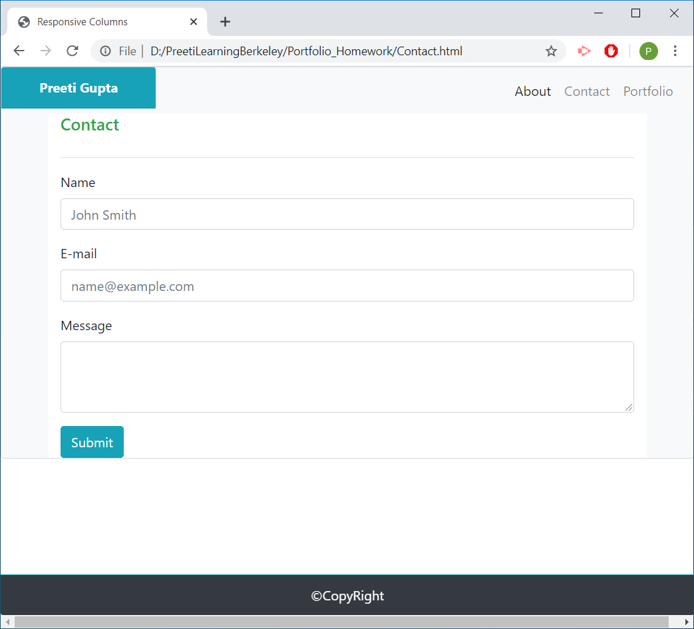
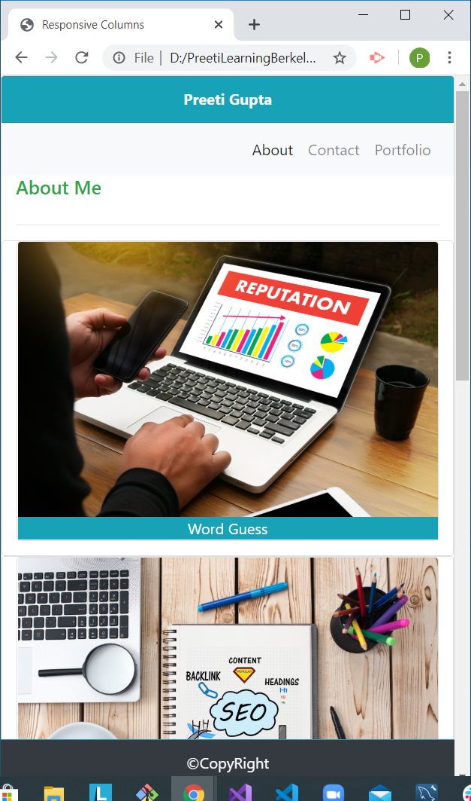
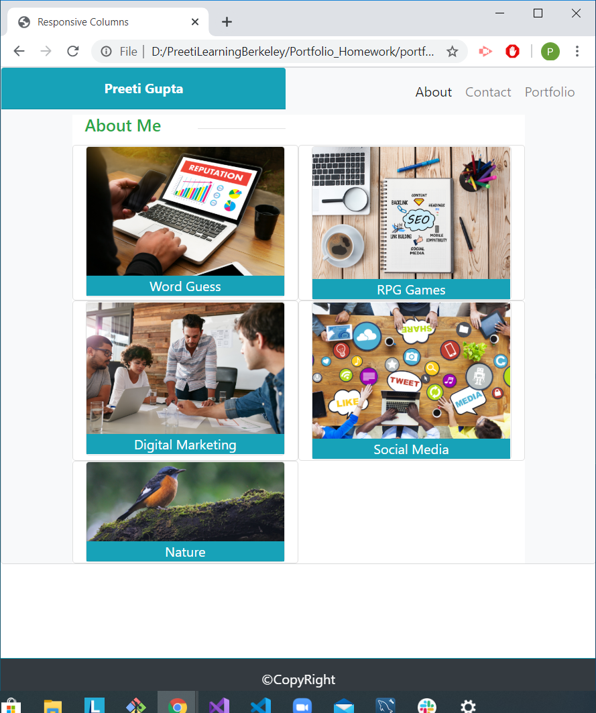

# Portfolio_Homework
We are making a responsive Portfolio for mobile and tablet using Bootstrap CSS Framework.

## Getting Started

### Prerequisites
1. Link to Bootstrap classes

### Link for Bootstrap [ Link for Bootstrap] (<link rel="stylesheet" href="https://stackpath.bootstrapcdn.com/bootstrap/4.5.0/css/bootstrap.min.css" integrity="sha384-9aIt2nRpC12Uk9gS9baDl411NQApFmC26EwAOH8WgZl5MYYxFfc+NcPb1dKGj7Sk" crossorigin="anonymous">)

2. *HTML*

3. Some internal styles

##  Details of Project

### It has 3 files named

*--index.html*

*--contact.html* 

*--portfolio.html*

Link [title]  (https://preeti1234567.github.io/Portfolio_Homework/)

 

